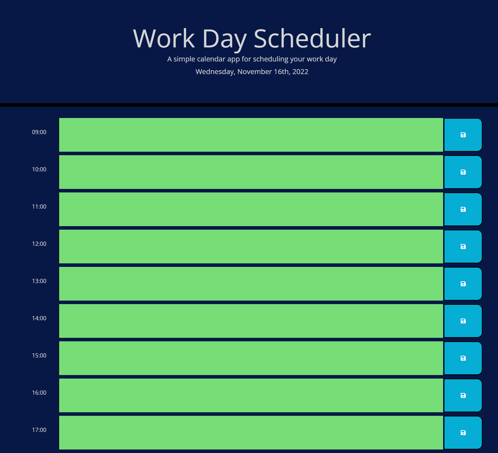

# Work Day Scheduler

This application is a simple scheduling utility that allows a user to list and save appointments by the hour within a range of typical business hours. The text fields for each hour are color coded to indicate if a given hour is past, present, or future.

The application stores the user's inputs locally, allowing them to leave or refresh the page without losing any saved appointments.

## Application
The homepage can be viewed [here](https://chocochip287.github.io/work-day-scheduler/).

## Screenshot
